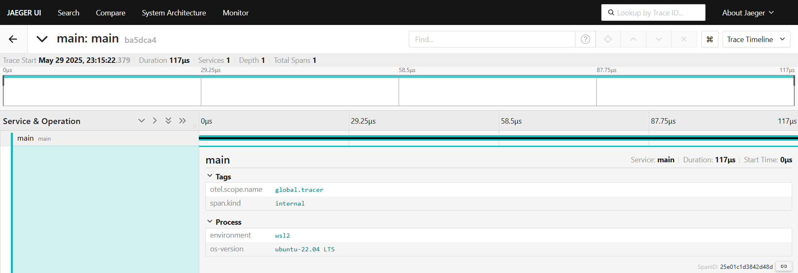

## capstone-otel-trace

This repo demonstrates use of Opentelemetry instrumentation for Trace(signal)

> [!NOTE]
> This repo uses Python language to demonstrate Opentelemetry Trace instrumentation.

#### Manual Instrumentation:
- Need to use the OpenTelemetry SDK for your language. 
- You’ll then use the SDK to initialize OpenTelemetry and the API  to instrument your code. 
- This will emit telemetry from your app.

#### Trace Console Exporter:

- This emits the Trace output on Console.

**Example Trace Output:**

```
{
    "name": "main",
    "context": {
        "trace_id": "0x8fb333fdd183a08dc3ac57f7b27437d9",
        "span_id": "0x714abafd57c290f9",
        "trace_state": "[]"
    },
    "kind": "SpanKind.INTERNAL",
    "parent_id": null,
    "start_time": "2025-05-29T05:36:31.207777Z",
    "end_time": "2025-05-29T05:36:31.208000Z",
    "status": {
        "status_code": "UNSET"
    },
    "attributes": {},
    "events": [],
    "links": [],
    "resource": {
        "attributes": {
            "service.name": "main",
            "os-version": "ubuntu-22.04 LTS",
            "environment": "wsl2"
        },
        "schema_url": ""
    }
}
```

#### Trace OTLP Exporter:

- This emits the Trace output to Jaeger backend using OTLP/grpc.

**Example Trace Output:**


