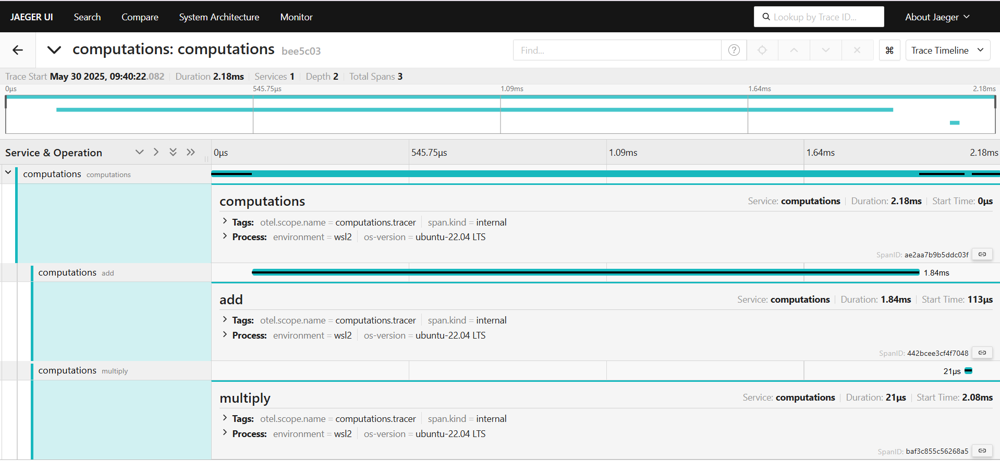

## capstone-otel-trace

This repo demonstrates use of Opentelemetry instrumentation for Trace(signal)

> [!NOTE]
> This repo uses Python language to demonstrate Opentelemetry Trace instrumentation.

#### Manual Instrumentation:
- Need to use the OpenTelemetry SDK for your language. 
- You’ll then use the SDK to initialize OpenTelemetry and the API  to instrument your code. 
- This will emit telemetry from your app.

#### Trace Console Exporter:

- This emits the Trace output on Console.

**Example Trace Output:**

```
{
    "name": "main",
    "context": {
        "trace_id": "0x8fb333fdd183a08dc3ac57f7b27437d9",
        "span_id": "0x714abafd57c290f9",
        "trace_state": "[]"
    },
    "kind": "SpanKind.INTERNAL",
    "parent_id": null,
    "start_time": "2025-05-29T05:36:31.207777Z",
    "end_time": "2025-05-29T05:36:31.208000Z",
    "status": {
        "status_code": "UNSET"
    },
    "attributes": {},
    "events": [],
    "links": [],
    "resource": {
        "attributes": {
            "service.name": "main",
            "os-version": "ubuntu-22.04 LTS",
            "environment": "wsl2"
        },
        "schema_url": ""
    }
}
```

#### Trace OTLP Exporter:

- This emits the Trace output to Jaeger backend using OTLP/grpc.

**Example Trace Output:**


### Context propogation:

- This demonstrates  the Trace context propogation to Jaeger backend using OTLP/grpc.



**Example Trace Output:**

```
{
  "data": [
    {
      "traceID": "bee5c036a10487a5df817efc1f41e2b1",
      "spans": [
        {
          "traceID": "bee5c036a10487a5df817efc1f41e2b1",
          "spanID": "442bcee3cf4f7048",
          "operationName": "add",
          "references": [
            {
              "refType": "CHILD_OF",
              "traceID": "bee5c036a10487a5df817efc1f41e2b1",
              "spanID": "ae2aa7b9b5ddc03f"----------------------------> Parent SpanID propogated
            }
          ],
          "startTime": 1748578222083054,
          "duration": 1844,
          "tags": [
            {
              "key": "otel.scope.name",
              "type": "string",
              "value": "computations.tracer"
            },
            {
              "key": "span.kind",
              "type": "string",
              "value": "internal"
            }
          ],
          "logs": [],
          "processID": "p1",
          "warnings": null
        },
        {
          "traceID": "bee5c036a10487a5df817efc1f41e2b1",
          "spanID": "baf3c855c56268a5",
          "operationName": "multiply",
          "references": [
            {
              "refType": "CHILD_OF",
              "traceID": "bee5c036a10487a5df817efc1f41e2b1",
              "spanID": "ae2aa7b9b5ddc03f"----------------------------> Parent SpanID propogated
            }
          ],
          "startTime": 1748578222085023,
          "duration": 21,
          "tags": [
            {
              "key": "otel.scope.name",
              "type": "string",
              "value": "computations.tracer"
            },
            {
              "key": "span.kind",
              "type": "string",
              "value": "internal"
            }
          ],
          "logs": [],
          "processID": "p1",
          "warnings": null
        },
        {
          "traceID": "bee5c036a10487a5df817efc1f41e2b1",
          "spanID": "ae2aa7b9b5ddc03f",----------------------------> Parent SpanID
          "operationName": "computations",
          "references": [],
          "startTime": 1748578222082941,
          "duration": 2183,
          "tags": [
            {
              "key": "otel.scope.name",
              "type": "string",
              "value": "computations.tracer"
            },
            {
              "key": "span.kind",
              "type": "string",
              "value": "internal"
            }
          ],
          "logs": [],
          "processID": "p1",
          "warnings": null
        }
      ],
      "processes": {
        "p1": {
          "serviceName": "computations",
          "tags": [
            {
              "key": "environment",
              "type": "string",
              "value": "wsl2"
            },
            {
              "key": "os-version",
              "type": "string",
              "value": "ubuntu-22.04 LTS"
            }
          ]
        }
      },
      "warnings": null
    }
  ],
  "total": 0,
  "limit": 0,
  "offset": 0,
  "errors": null
}
```